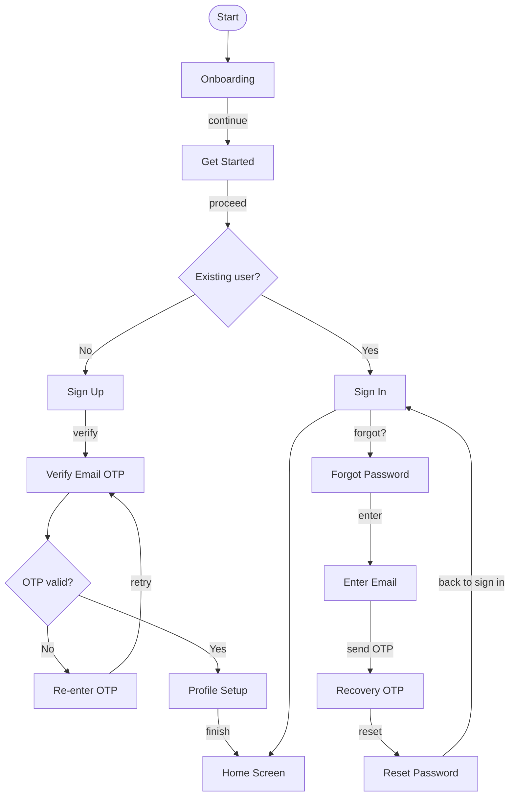
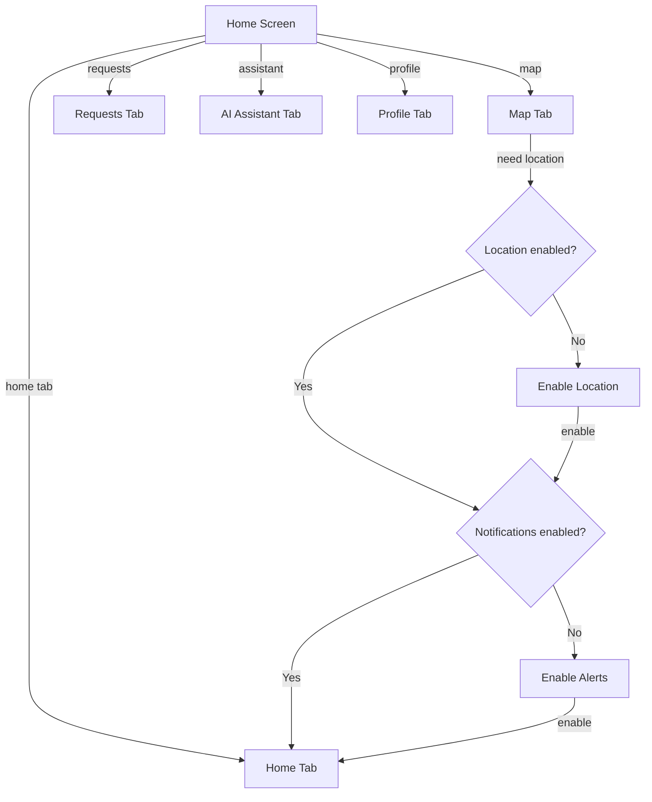
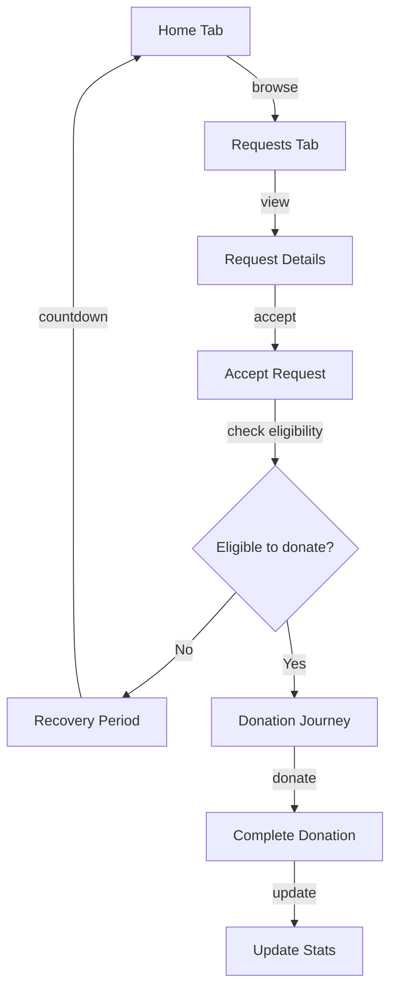
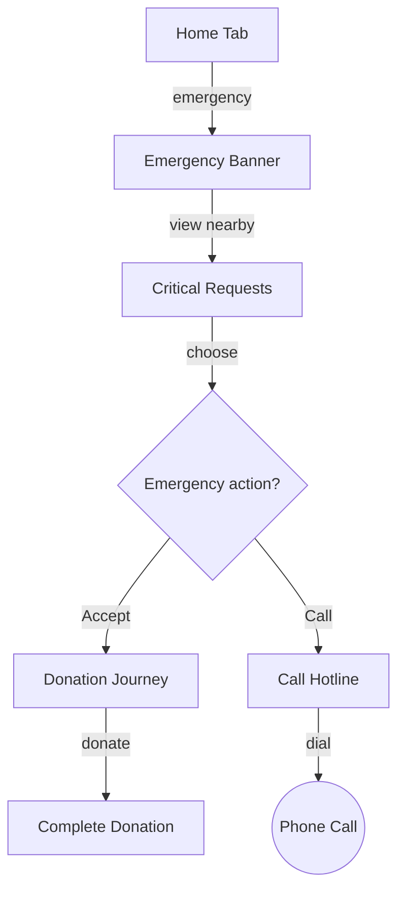
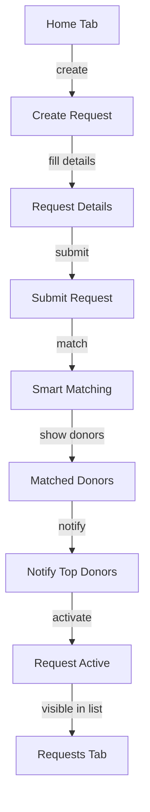
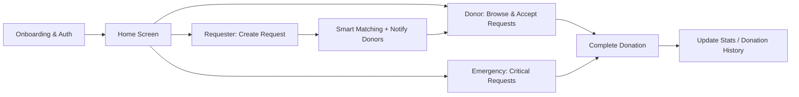

# Shoryan — Blood Donation Matching App

> Shoryan is a mobile-first platform that connects patients in need of blood with compatible, eligible, nearby donors — quickly, and without the guesswork.

---

## Overview

Shoryan lets users register as **donors**, **requesters (patients)**, or both. A requester can post an **"ask"** specifying blood type, hospital location, and urgency. Nearby, eligible donors see these asks in a location-based feed — much like a social media feed — and can accept or reject the request directly from the app.

Beyond simple matching, Shoryan applies data science to predict which donors are most likely to respond to a given ask, based on blood-type compatibility, location, and eligibility. The app also sends automated reminders to donors who have become eligible again (3+ months since their last donation), and includes an AI chatbot that answers common donation-related questions.

---

## Problem Statement

Finding a compatible blood donor during an emergency is often slow, manual, and inefficient:

- Hospitals and patients typically rely on word-of-mouth, social media posts, or manual phone calls to find donors — wasting critical time in emergencies.
- Existing donors aren't notified in a targeted way; requests are broadcast broadly instead of reaching donors who are actually eligible, nearby, and likely to respond.
- Willing, eligible donors often don't donate simply because they forget when they become eligible again, or never hear about nearby requests.
- There's no reliable way to prioritize urgent/critical cases over routine requests, so patients in genuine emergencies compete for attention with non-urgent asks.
- Donors have common, repetitive questions (eligibility, pre/post-donation care, compatibility) with no immediate, trustworthy source of answers.

**Shoryan closes these gaps** by combining location-based matching, predictive prioritization, and automated engagement (reminders + chatbot) into a single platform.

---

## Target Audience

| Segment                                                | Description                                                                                                                                             |
| ------------------------------------------------------ | ------------------------------------------------------------------------------------------------------------------------------------------------------- |
| **Blood Donors**                                       | Individuals who are willing and medically eligible to donate blood, and want to be notified of nearby, relevant requests instead of generic broadcasts. |
| **Requesters / Patients & their families**             | People who need to find a compatible blood donor urgently, often during a medical emergency.                                                            |
| **Hospitals & Blood Banks** _(indirect beneficiaries)_ | Benefit from faster donor turnaround and reduced reliance on manual, ad-hoc donor searches.                                                             |

---

## Tech Stack

| Layer              | Technology                   |
| ------------------ | ---------------------------- |
| Mobile App         | Flutter / Dart               |
| Backend / API      | Laravel (PHP)                |
| Database           | MySQL                        |
| API Authentication | Laravel Sanctum & Breeze     |
| Notifications      | Firebase (FCM)               |
| AI Chatbot         | RAG Knowledge-based          |
| Data Science       | Python, pandas, scikit-learn |
| Model Serving      | FastAPI                      |
| Deployment         | Vercel, Aiven                |

### AI & Data Science — Donor Response Prediction

A trained model predicts whether a donor is likely to be available for a given ask, based on blood-type compatibility, location,weight, hemoglobin, gender and age. Its output is a ranked list of best-matching donors for a request.

- **Dataset:** Blood Donor Dataset (Kaggle)

### AI Chatbot Knowledge Base

The chatbot is grounded in a fixed knowledge base covering:

- **Eligibility guidelines** — age 18–65, minimum weight 50kg, donation interval of every 3 months, general good health required
- **Before donation** — eat a healthy meal, stay hydrated, get enough sleep, bring a national ID
- **After donation** — drink extra fluids, avoid heavy exercise for the rest of the day, keep the bandage on for a few hours, eat iron-rich foods
- **Blood type compatibility**
- **Permanent restrictions** — HIV, Hepatitis B/C, blood cancers (leukemia, lymphoma, myeloma)
- **Temporary restrictions** — pregnancy/recent childbirth, anemia, active fever/infection, recent major surgery, recent transfusion, uncontrolled high blood pressure, uncontrolled heart disease, recent travel to malaria-risk areas, recent live vaccines, temporarily disqualifying medications, recent tattoos/piercings, recent exposure to hepatitis or other infectious disease

---

## User Flow

### 1. Onboarding & Authentication

### 2. Home Navigation

### 3. Donor Flow — Browsing & Accepting Requests

### 4. Emergency / Critical Requests Flow

### 5. Requester Flow — Creating & Matching a Request

### 6. End-to-End Flow (High Level)

---
